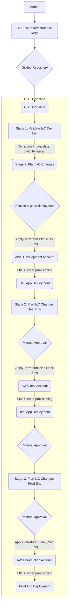

## Changelog
v0.1.0 - Introduce IaC for EKS Cluster in AWS

# mastercard-sre

## TODO
- Test on live AWS account
- Improve missing bits
- Develop / deploy first application 
- Introduce observability
    - Metrics, Traces, Alerting

